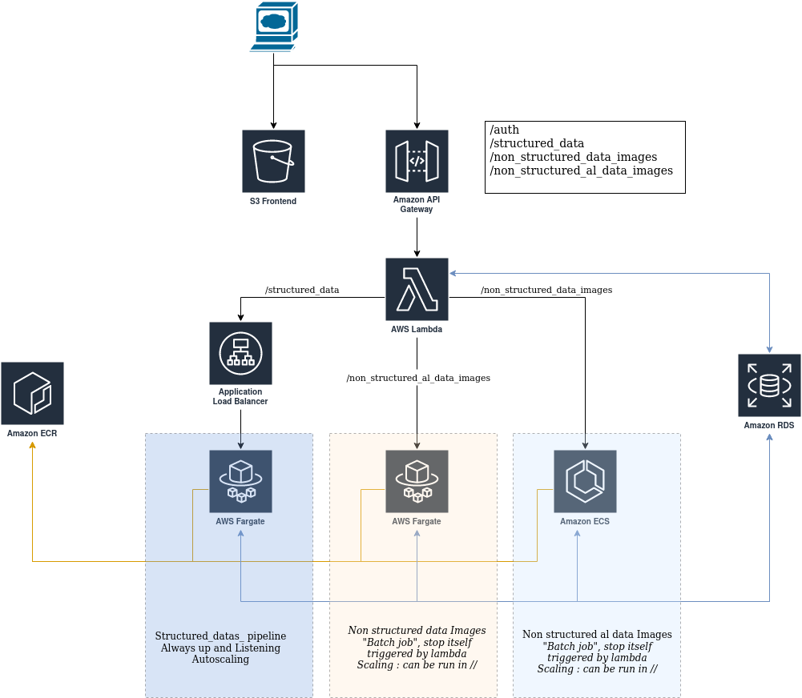

# Use case ML devops   

Have an easy-to-operate platform, reliable, efficient, with predictable costs

## Hypothesis  
- _Structured_datas_ pipeline is fast, and there is 1 request per minute.
- _Non structured data Images_ pipeline takes 25minutes to run, with 1 request per hour, during french business hours.  
- _Non structured active learning data Images_ pipeline takes 5 hours to run, but is rarely triggered.

## AWS Architecture  

Frontend in NodeJS, hosted in S3.  
API Gateway + Lambda as a backend, one path and function per pipeline:  

    - https://apigateway.aws/structured_data { "id": "1789" }  
    - https://apigateway.aws/non_structured_data_images { "link": "http://imag.es/img.png" }  
    - https://apigateway.aws/non_structured_al_data_images { "id": "1914", "id": "1918", "id": "1939" }
    - https://apigateway.aws/auth

  
Each path has an associated lambda function.   
Lambda functions can read/write to a database: RDS, MongoDB depending of the structure of the tables.  

 -   _Structured_datas_ pipeline runs on ECS/Fargate, always up and listening behind an ALB. Lambda triggers the job with a https request. Scaling policy.
 -   _Non structured data Images_ runs on Fargate, triggered by lambda, and stopped itself when done.
 -  _Non structured active learning data Images_runs on ECS with GPU instances, triggered by lambda, and stopped itself when done.

Docker images are store in ECR. Fargate/ECS task can read/write in S3 if needed.

## CI/CD
Assuming we have the following environment (separated AWS account):
 - production: where pipelines run, and clients are
 - preproduction: up on demand, can be used for validation/test purpose
 - qa: automatic deployment when PR occurs to develop branch

The deployment tool is Github Action.

### GIT Workflow
Deployment to production master when a PR is merged in master
Deployment to preproduction when a PR is merged in develop, **if needed**

Every PR triggers a validation process, and is merged only if the process is successful

Repository:

    terraform/
    frontend/
    backend/
      lambda1/
      lambda2/
      lambda3/
    pipelines/
       structured_data/
         Dockerfile
         Code/
       non_structured_data_images/
         Dockerfile
         Code/
       Non structured active learning data Images/
         Dockerfile
         Code/

### Lambda

Using github action, code is packaged in a .zip archive and is sync to S3.

### Terraform

Using Github Action, every change in terraform folder will trigger an action to deploy the infrastructure.

### Pipelines

Every change in pipelines folder will trigger an action (one per pipeline) to build Docker image from dockerfile and push it to ECR.

### Frontend

Every change in frontend folder will trigger an action to build app and sync it to S3.

## Security

AWS best practices:
- Strict security group
- IAM permissions
- Network isolation, usage of private subnet

DDos attacks are mitigated thanks to IAM on API Gateway (managed by /auth path). Cloudfront + AWS WAF can also be added.

## Monitoring of ML model

### Infrastructure monitoring
Infrastructure is monitored using Cloudwatch. Alerts are defined in terraform on metrics & logs.

### model put into prod
Models already in production are checked every minute using monitoring tool + log analysis
Alert is triggered if an incident occurs

### model updated
Models are updated in production only if pipeline succeed. The pipeline include set of data to ensure all features are tested.
For breaking changes in models, manual validation can be mandatory before the production deployment (cf following section)

### model evaluation before new version put into prod
The model is tested on preproduction environment. New version should also update the validation process with new dataset to ensure new features are tested.

